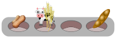

# Assessed assignment 1

## Instructions

* If you have not yet cloned the module Gitlab repository, then do that with:
  ```shell
  git clone https://git.cs.bham.ac.uk/zeilbern/fp-learning-2019-2020.git
  ```
  If you've already cloned the repository, run
  ```shell
  git pull
  ```
  to ensure that you have the most recent version including this assignment.

* Go into the "Assignments/Assessed/Assessed1" directory and *copy* the given `Assessed1Template.hs` to a *new* file `Assessed1.hs`.
  Work on that file to produce your solution and then submit it to Canvas.

  It is important to copy the file as explained, since any future `git pull` may overwrite the template. Hence don't work directly on the template.

* If you work inside another directory besides the git repository, you will also need to copy the file `Types.hs`, which includes type definitions that are imported by the template file.
  Any data or types that you define **yourself** should be in `Assessed1.hs`, but the ones defined in the assignment are and should stay in `Types.hs`.

* Be aware that:

  * Your solutions must work with GHC 8.6.5. To use GHC 8.6.5 on a lab machine, see [HardwareAndSoftware.md](../../Resources/HardwareAndSoftware.md).

  * If you wish to import modules, then you may only import libraries from [the standard library](http://hackage.haskell.org/package/base). Additionally, all modules you import must be "Safe" on Hackage.

  * **The questions are in roughly increasing order of difficulty.**  You should try all of them, but IT IS OKAY IF YOU DON'T FIND SOLUTIONS TO ALL THE QUESTIONS.

## Questions

This assignment is worth a total of 60 marks, going towards the 200 marks of your continous assessment score.
Since continuous assessment is weighted 20% towards the final mark, you can calculate that 10 marks on this assignment are valued at 1% of your final mark.

1. Complete the functions below involving lists and `Maybe` types.

   * **[10 marks]**
     Write a function
     ```haskell
     doubleList :: [a] -> [a]
     doubleList = undefined
     ```
     which takes a list and returns a new list where every element is replaced by two copies of itself.
     (For example, `doubleList [1..3] == [1,1,2,2,3,3]` and `doubleList "yes!" == "yyeess!!"`.)

   * **[10 marks]**
     Write a function
     ```haskell
     firstDoubled :: Eq a => [a] -> Maybe a
     firstDoubled = undefined
     ```
     which takes a list and returns `Just` the first element that appears at least twice in order with no elements in between,
     or else `Nothing` if no such element exists.
     (For example, `firstDoubled [1,2,2,3,3] == Just 2` but `firstDoubled [1,2,3,2,3] == Nothing`.)

2. [Adapted from [Hameer & Pientka 2018](https://www.cs.mcgill.ca/~bpientka/papers/learn-ocaml-icfp19.pdf)]
   You work at a cupcake shop that has recently taken the step of migrating their operations to Haskell.
   In the shop manual, a *recipe* is now represented as a list of ingredients (possibly containing duplicates), and a *cupcake* is represented as a recipe together with a price.
   ```haskell
   data Ingredient = Nuts | Gluten | Soy | Dairy   deriving (Show, Eq)
   type Recipe = [Ingredient]
   data Price = P Int                              deriving (Show, Eq, Ord)
   data Cupcake = CC Price Recipe                  deriving (Show, Eq)
   ```
   To improve customer experience, you need to write some functions to let clients quickly filter cupcakes by different criteria.

   * **[10 marks]**
     Write a function
     ```haskell
     priceRange :: Price -> Price -> [Cupcake] -> [Cupcake]
     priceRange = undefined
     ```
     such that `priceRange minPrice maxPrice cupcakes` returns just those `cupcakes` whose price is between `minPrice` and `maxPrice` (inclusive).
     (For example, `priceRange (P 200) (P 300) [CC (P 200) [Soy], CC (P 250) [Dairy], CC (P 400) [Nuts,Gluten]]` should return `[CC (P 200) [Soy], CC (P 250) [Dairy]]`.)

   * **[10 marks]**
     Write a function
     ```haskell
     allergyFree :: [Ingredient] -> [Cupcake] -> [Cupcake]
     allergyFree = undefined
     ```
     such that `allergyFree allergens cupcakes` returns just those `cupcakes` that do not contain any `allergens`.
     (For example, `allergyFree [Dairy] [CC (P 200) [Soy], CC (P 250) [Dairy], CC (P 400) [Nuts,Gluten]]` should return `[CC (P 200) [Soy], CC (P 400) [Nuts,Gluten]]`.)

3. You are tasked with assuring quality at the bakery for the cupcake shop.
   Under normal operations, cupcakes are baked together in batches on a cupcake tin before being priced.
   To improve quality control, you would like to add an additional step of checking that every tin satisfies some formal specification before it is baked.
   You introduce the following types:
   ```haskell
   type Tin = [Recipe]
   data Spec = And Spec Spec | Or Spec Spec | Not Spec | HasCup Int Ingredient  deriving (Show,Eq)
   ```
   Such specifications are meant to be interpreted as follows:
   * a tin satisfies the specification `And s1 s2`  if it satisfies both `s1` and `s2`
   * a tin satisfies the specification `Or s1 s2`   if it satisfies either `s1` or `s2`
   * a tin satisfies the specification `Not s`      if it does not satisfy the specification `s`
   * a tin satisfies the specification `HasCup k x` if the cupcake at position `k` (using [0-indexing](https://en.wikipedia.org/wiki/Zero-based_numbering)) contains the ingredient `x`

   For example, the sample tin pictured below (image not to scale)

   

   ```haskell
   sampletin :: Tin
   sampletin = [[Nuts], [Dairy,Gluten], [], [Soy]]
   ```

   satisfies the specification

   ```hs
   And (HasCup 0 Nuts) (And (HasCup 1 Gluten) (And (Not (HasCup 2 Dairy)) (HasCup 3 Soy)))
   ```

   but does not satisfy the specification

   ```hs
   Or (HasCup 0 Dairy) (HasCup 1 Soy)
   ```

   * **[5 marks]**
     Write a function
     ```haskell
     checkSpec :: Spec -> Tin -> Bool
     checkSpec = undefined
     ```
     which takes a specification `s` and a tin `t` as inputs, and returns `True` just in case `t` satisfies the specification `s`, or else `False`.
     For this question, you can assume that all `HasCup k x` specifications use valid indices 0 <= k < n, where n is the number of cups in the tin `t`.

   * **[5 marks]**
     Adapt your solution above so that it also checks that the specification is well-formed:
     ```haskell
     checkSpec' :: Spec -> Tin -> Maybe Bool
     checkSpec' = undefined
     ```
     Now `checkSpec'` should return `Nothing` if the specification contains *any* statement of the form `HasCup k x` where `k` is out of bounds of the tin, otherwise it should return `Just` a boolean indicating whether or not the tin satisfies the (well-formed) specification.

4. Sometimes during slow hours at the cupcake shop you do a bit of tinkering with sorting algorithms, and now you believe you've devised an algorithm for sorting in linear time! It applies to lists of any type of values with a comparison operation, and the basic idea is to use an auxiliary stack.
   In more detail, here's how the algorithm works:
   * Begin by initializing an empty stack
   * Scan the input values in order. For each value x:
     - If the stack is nonempty and x is larger than the top item, then pop the top item on the stack to the output
     - Repeat the previous step until either the stack is empty or x is less than or equal to the top item, and then push x onto the stack
   * Once there are no more input values, pop the remaining values on the stack over to the output

   For example, suppose the input is the list of integers [4,2,1,3].  The algorithm performs the following actions:
   * Read 4 from the input. Since the stack is empty, push 4 onto the stack. (Current stack = [4])
   * Read 2 from the input. Since 2 <= 4, push 2 onto the stack. (Current stack = [2,4])
   * Read 1 from the input. Since 1 <= 2, push 1 onto the stack. (Current stack = [1,2,4])
   * Read 3 from the input. Since 3 > 1, pop 1 to the output. (Current stack = [2,4])
   * Since 3 > 2, pop 2 to the output. (Current stack = [4])
   * Since 3 <= 4, push 3 onto the stack. (Current stack = [3,4])
   * Since there are no more input values, pop 3 and 4 to the output.

   Observe that the input values have been popped in the order [1,2,3,4].
   In general, since each input value is pushed and later popped exactly once, the algorithm always runs in linear time.
   Fantastic!

   * **[4 marks]**
     Implement the above algorithm in Haskell as a function
     ```haskell
     linearSort :: Ord a => [a] -> [a]
     linearSort = undefined
     ```
     from input lists to output lists.
     For example, you should have `linearSort [4,2,1,3] == [1,2,3,4]`.
     (Part of this question is figuring out how to represent the auxiliary stack.)

   You're starting to have doubts whether your algorithm really always *sorts* the input list in general.
   With a bit of testing, you manage to find a simple counterexample in the form of a list `xs :: [Int]` such that `sort xs == [1,2,3]` but `linearSort xs /= [1,2,3]`.
   Oh no!

   * **[1 mark]**
     What was your counterexample?
     ```haskell
     counterexample :: [Int]
     counterexample = undefined
     ```

   After your initial disappointment, you decide to go back and look more carefully at the cases for which the algorithm *does* successfully sort the input.
   You try running `linearSort` on all possible permutations of the list `[1..n]` for increasing values of `n`, and notice a remarkable pattern in the number of such permutations that the algorithm successfully sorts:
   ```hs
   > [length [xs | xs <- permutations [1..n], linearSort xs == [1..n]] | n <- [0..]]
   [1,1,2,5,14,42,132,429,1430,4862,16796,  C-c C-cInterrupted.
   ```
   Entering this sequence of numbers into the [On-Line Encyclopedia of Integer Sequences](https://oeis.org/search?q=1%2C1%2C2%2C5%2C14%2C42%2C132%2C429%2C1430%2C4862%2C16796&language=english&go=Search) confirms your suspicion that these are the [Catalan numbers](https://en.wikipedia.org/wiki/Catalan_number)!
   Since you know that the Catalan numbers also count unlabelled binary trees, you wonder whether there is a connection between binary trees and `linearSort`able permutations...

   * **[5 marks] (HARD!)**
     Let `Bin` be a data type of unlabelled binary trees, defined as follows:
     ```haskell
     data Bin = L | B Bin Bin  deriving (Show,Eq)
     ```
     Write a pair of functions
     ```haskell
     fromBin :: Bin -> [Int]
     fromBin = undefined

     toBin :: [Int] -> Maybe Bin
     toBin = undefined
     ```
     that convert a binary tree to a `linearSort`able permutation, and vice versa.

     More precisely, `fromBin t` should take a binary tree `t` with `n` `B`-nodes and return a permutation `xs` of `[1..n]` such that `linearSort xs == [1..n]`.
     Conversely, `toBin` should take a permutation `xs` of `[1..n]`, and in the case that `linearSort xs == [1..n]` should return `Just` a binary tree with `n` `B`-nodes, otherwise it should return `Nothing`.
     (If `xs` is not a permutation of `[1..n]`, then `toBin` can return an arbitrary value.)
     Finally, these functions should be partial inverses in the sense that
     ```hs
     toBin (fromBin t) == Just t
     ```
     for all `t :: Bin`, and
     ```hs
     fromBin (fromJust $ toBin xs) == xs
     ```
     for all `xs :: [Int]` such that `linearSort xs == [1..n]`.
