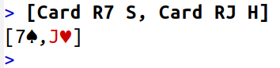

# Assessed assignment 2

## Instructions

* If you have not yet cloned the module Gitlab repository, then do that with:
  ```shell
  git clone https://git.cs.bham.ac.uk/zeilbern/fp-learning-2019-2020.git
  ```
  If you've already cloned the repository, run
  ```shell
  git pull
  ```
  to ensure that you have the most recent version including this assignment.

* Go into the "Assignments/Assessed/Assessed2" directory and *copy* the given `Assessed2Template.hs` to a *new* file `Assessed2.hs`.
  Work on that file to produce your solution and then submit it to Canvas.

  It is important to copy the file as explained, since any future `git pull` may overwrite the template. Hence don't work directly on the template.

* If you work inside another directory besides the git repository, you will also need to copy the file `Types.hs`, which includes type definitions that are imported by the template file.
  Any data or types that you define yourself should be in `Assessed2.hs`, but the ones defined in the assignment are and should stay in `Types.hs`.
  You should **not** modify the `Types.hs` file.

* Because the marking is automatic, we need your submission to be in the correct format, and compile and type check without errors.
  A "presubmit" script will be released, which you need to run before you submit your assignment on Canvas.
  **Submissions that don't pass the presubmit test won't qualify for marks.**

* Be aware that:

  * Your solutions must work with GHC 8.6.5. To use GHC 8.6.5 on a lab machine, see [HardwareAndSoftware.md](../../Resources/HardwareAndSoftware.md).


  * If you wish to import modules, then you may only import libraries from [the standard library](http://hackage.haskell.org/package/base). Additionally, all modules you import must be "Safe" on Hackage.

  * Some of the questions are harder than others, and these are indicated according to the rubric below.
    Also, although complete solutions are required to satisfy several requirements as specified below, partial credit may be awarded for fulfilling a subset of these requirements, according to the judgment of the lecturers and TAs.
    IT IS OKAY IF YOU DON'T FIND COMPLETE SOLUTIONS TO ALL THE QUESTIONS.

## Background

### Playing cards

Some of the questions make reference to cards drawn from a [standard 52-card deck](https://en.wikipedia.org/wiki/Standard_52-card_deck).
A standard playing card has both a *rank* and a *suit*: the rank can be a number between 2 to 10 or a jack or queen or king or ace; the suit can be clubs or diamonds or hearts or spades.

We represent standard playing cards and a standard 52-card deck with the following definitions in Haskell:
```haskell
data Rank = R2 | R3 | R4 | R5 | R6 | R7 | R8 | R9 | R10 | RJ | RQ | RK | RA
  deriving (Eq,Ord,Enum)
data Suit  = C | D | H | S
  deriving (Eq,Ord,Enum)
data Card = Card { rank :: Rank, suit :: Suit }
  deriving (Eq)
type Deck = [Card]

standard52 :: Deck
standard52 = [Card {rank = r, suit = s} | r <- [R2 .. RA], s <- [C .. S]]
```

### Picking monads and probability distributions

Some of the questions make reference to the `PickingMonad` class that was introduced in the [previous formative assignment](../../Formative/Formative2/README.md).
Recall that this class builds on the `Monad` class by adding an operation `pick lo hi`, which is supposed to represent a choice of value ranging from the lower bound `lo` to the upper bound `hi` (inclusive in both bounds).
```haskell
class Monad m => PickingMonad m where
  pick :: Int -> Int -> m Int
```
In the previous assignment, we defined an instance of `PickingMonad` for the `IO` monad where `pick` was implemented by calling the system random number generator.
Here we'll tweak the implementation a bit so that it also ensures that `lo <= hi` (raising an error otherwise).
```haskell
instance PickingMonad IO where
  pick lo hi | lo <= hi  = getStdRandom (randomR (lo, hi))
             | otherwise = error ("pick lo hi: lo = " ++ show lo ++ " is greater than hi = " ++ show hi)
```
For the purpose of testing your code in this assignment (testing by you and by the TAs), it will be helpful to introduce a couple other instances of `PickingMonad`.
The [List monad](../../../LectureNotes/monads.md) supports an easy implementation of the `pick` operation where we just return the list of all possible values (after checking that `lo <= hi`):
```haskell
instance PickingMonad [] where
  pick lo hi | lo <= hi  = [lo..hi]
             | otherwise = error ("pick lo hi: lo = " ++ show lo ++ " is greater than hi = " ++ show hi)
```
A more sophisticated implementation of `pick` is based on the monad of *finite probability distributions*.
This monad can be seen as a refinement of the List monad supporting probabilistic computation: now we keep track not only of the list of possible values, but also their associated probabilities.

In Haskell, the monad of finite probability distributions can be defined as follows:
```haskell
newtype Dist a = Dist { dist :: [(a,Rational)] }  deriving (Show)

instance Monad Dist where
  return x = Dist [(x,1)]
  xm >>= f = Dist [(y,p*q) | (x,p) <- dist xm, (y,q) <- dist (f x)]
```
together with the standard boilerplate:
```haskell
instance Functor Dist where
  fmap f xm = xm >>= return . f

instance Applicative Dist where
  pure = return
  xm <*> ym = xm >>= \x -> ym >>= return . x
```
And then the `pick` operation can be implemented as follows:
```haskell
instance PickingMonad Dist where
  pick lo hi | lo <= hi = Dist [(x,1 / fromIntegral (hi - lo + 1)) | x <- [lo..hi]]
             | otherwise = error ("pick lo hi: lo = " ++ show lo ++ " is greater than hi = " ++ show hi)
```
This defines `pick lo hi` as a probability distribution taking any value between `lo` and `hi` with equal probability, in other words, as the [uniform distribution](https://en.wikipedia.org/wiki/Discrete_uniform_distribution) on the interval `[lo .. hi]`.

To illustrate these different implementations of picking monads, consider the following simple program that picks a number between 0 and 3 and then uses it to index into the string "hello":
```haskell
code :: PickingMonad m => m Char
code = do
  i <- pick 0 3
  return ("hello" !! i)
```

Here is a sample transcript of running `code` using the `IO` monad by default (multiple runs can give different results):
```
> code   -- this runs in the IO monad by default
'h'
> code
'l'
```
Now running it using the List monad (always returns the same result):
```
> code :: [Char]
"hell"
```
And running it using the monad of finite probability distributions (always returns the same result):
```
> code :: Dist Char
Dist {dist = [('h',1 % 4),('e',1 % 4),('l',1 % 4),('l',1 % 4)]}
```
In the last sample run, observe that our representation of finite probability distributions allows the same value to occur multiple times in the list of value/probability pairs.
The following function will compute the *total* probability of a value occurring in a given distribution, assuming that the values come from an `Eq` type:

```haskell
prob :: Eq a => Dist a -> a -> Rational
prob xm x = sum [p | (y,p) <- dist xm, x == y]
```

Similarly, the following function will "normalise" a distribution by first computing the list of values in its [support](https://en.wikipedia.org/wiki/Support_(mathematics)#In_probability_and_measure_theory), and then returning the probabilities of all those values:
```haskell
normalise :: Eq a => Dist a -> Dist a
normalise xm = Dist [(x,prob xm x) | x <- support xm]
  where
    support :: Eq a => Dist a -> [a]
    support xm = nub [x | (x,p) <- dist xm, p > 0]  -- "nub" removes duplicates from a list
```

Examples:
```
> prob code 'l'
1 % 2
> normalise code
Dist {dist = [('h',1 % 4),('e',1 % 4),('l',1 % 2)]}
```
(We didn't need to put any type annotations above, since the type `code :: Dist Char` is automatically inferred from the calls to `prob` and `normalise`.)

## Questions

This assignment is worth a total of 60 marks.

Questions marked "★" are probably harder than the others, and questions marked "⚠️" are quite challenging...you have been warned!


1. Define an instance of the `Show` class for the following types:
   * **[5 marks]** `Rank`, showing the ranks as "2", "3", "4", "5", "6", "7", "8", "9", "10", "J", "Q", "K", and "A", respectively.
     ```haskell
     instance Show Rank where
       show = undefined
     ```
   
   * **[5 marks]** `Suit`, showing the suits as "♣" (Unicode Decimal Code 9827) for clubs, "♦" (9830) for diamonds, "♥" (9829) for hearts, and "♠" (9824) for spades.
     ```haskell
     instance Show Suit where
       show = undefined
     ```
   
   * **[10 marks]** `Card`, showing the rank followed by the suit (with no space in between), together with the appropriate [ANSI escape codes](https://en.wikipedia.org/wiki/ANSI_escape_code) so that cards whose suit is `D` or `H` render in red (when shown on an ANSI terminal), and cards whose suit is `C` or `S` render in black.
     ```haskell
     instance Show Card where
       show = undefined
     ```
     You can make use of the following helper functions, which take a string and surround it with the appropriate ANSI escape codes to render in red or black respectively:
     ```haskell
     red, black :: String -> String
     red   s = "\x1b[31m" ++ s ++ "\x1b[0m"
     black s = "\x1b[30m" ++ s ++ "\x1b[0m"
     ```
     Here are some examples showing the correct strings generated for the seven of spades and for the jack of hearts:
     ```
     > show (Card R7 S)
     "\ESC[30m7\9824\ESC[0m"
     > show (Card RJ H)
     "\ESC[31mJ\9829\ESC[0m"
     ```
     And here's what these might look like when rendered in an ANSI terminal with Unicode support:

     

2. Write some functions that are useful for working with picking monads:

   * **[5 marks]**
     A function which chooses an arbitrary element from a list.
     ```haskell
     choose :: PickingMonad m => [a] -> m a
     choose = undefined
     ```
     More precise requirements:
     * `choose xs` should run without error for any non-empty list `xs :: [a]` (for the empty list it can do anything)
     * in the case of the monad `m = IO`, `choose xs` should run in time proportional to the length of `xs`
     * in the case of the monad `m = Dist`, `choose xs :: Dist a` should compute a (not necessarily normalised) distribution where each value in `xs` is assigned a probability proportional to the number of times it occurs in `xs`.  That is, `prob xs x` should be equal to `k / n`, where `k = length [y | y <- xs, x == y]` and `n = length xs`.

     Examples:
     ```
     > choose standard52  -- multiple runs in the IO monad can return different results
     10♣
     > choose standard52
     K♠
     > choose [True,False] :: Dist Bool
     Dist {dist = [(True,1 % 2),(False,1 % 2)]}
     > prob (choose "hello") 'l'
     2 % 5
     ```

   * **[5 marks] (★)**
     A function which takes a monadic computation of a boolean (an "experiment") and runs it repeatedly, returning how many times it evaluates to `True`.
     ```haskell
     simulate :: Monad m => m Bool -> Integer -> m Integer
     simulate = undefined
     ```
     More precise requirements:
     * `simulate bm n` should run without error for any non-negative integer `n` (for `n < 0` it can do anything)
     * in the case of the monad `m = IO`, `simulate bm n` should run in time proportional to `n`
     * in the case of the monad `m = Dist`, `prob (simulate bm n) k` should give the probability that if the experiment `bm` is repeated `n` times, it will return `True` exactly `k` times.

     Examples:
     ```
     > simulate (choose [True,False]) 100000
     49932
     > normalise (simulate (choose [True,False]) 3)
     Dist {dist = [(3,1 % 8),(2,3 % 8),(1,3 % 8),(0,1 % 8)]}
     ```

3. Write some functions for [shuffling](https://en.wikipedia.org/wiki/Shuffling) a deck of cards:

   * **[5 marks]**
     A function which returns an arbitrary splitting of a list into two contiguous pieces.
     ```haskell
     cut :: PickingMonad m => [a] -> m ([a],[a])
     cut = undefined
     ```
     More precise requirements:
     * `cut xs` should run without error for any list `xs :: [a]` (including the empty list)
     * in the case of the monad `m = IO`, `cut xs` should return a pair of lists `(ys,zs)` whose concatenation `ys ++ zs` is `xs`, in time proportional to the length of `xs`
     * in the case of the monad `m = [ ]`, `cut xs :: [([a],[a])]` should compute the list of all possible pairs `(ys,zs)` whose concatenation `ys ++ zs` is `xs` (without duplicates)
     * in the case of the monad `m = Dist`, `cut xs :: Dist ([a],[a])` should compute the uniform distribution on all possible pairs of lists `(ys,zs)` whose concatenation `ys ++ zs` is `xs`.

     Examples:
     ```
     > cut standard52
     ([2♣,2♦,2♥,2♠,3♣,3♦,3♥,3♠,4♣,4♦,4♥,4♠,5♣,5♦,5♥],[5♠,6♣,6♦,6♥,6♠,7♣,7♦,7♥,7♠,8♣,8♦,8♥,8♠,9♣,9♦,9♥,9♠,10♣,10♦,10♥,10♠,J♣,J♦,J♥,J♠,Q♣,Q♦,Q♥,Q♠,K♣,K♦,K♥,K♠,A♣,A♦,A♥,A♠])
     > cut [1..5] :: [([Int],[Int])]
     [([],[1,2,3,4,5]),([1],[2,3,4,5]),([1,2],[3,4,5]),([1,2,3],[4,5]),([1,2,3,4],[5]),([1,2,3,4,5],[])]
     > cut [1..5] :: Dist ([Int],[Int])
     Dist {dist = [(([],[1,2,3,4,5]),1 % 6),(([1],[2,3,4,5]),1 % 6),(([1,2],[3,4,5]),1 % 6),(([1,2,3],[4,5]),1 % 6),(([1,2,3,4],[5]),1 % 6),(([1,2,3,4,5],[]),1 % 6)]}
     ```

   * **[10 marks] (★)**
     A function which returns an arbitrary shuffle of a pair of lists.
     ```haskell
     shuffle :: PickingMonad m => ([a],[a]) -> m [a]
     shuffle = undefined
     ```
     More precise requirements:
     * `shuffle (ys,zs)` should run without error for any pair of lists `ys, zs :: [a]` (including the empty lists)
     * in the case of the monad `m = IO`, `shuffle (ys,zs)` should return a list that is a possible interleaving of `ys` with `zs`, in time proportional to the sum of the lengths of `ys` and `zs`
     * in the case of the monad `m = Dist`, `shuffle (ys,zs) :: Dist [a]` should give the uniform distribution on all possible interleavings of `ys` with `zs`.

     Note the last requirement is a bit subtle.
     One way to get a uniform distribution is via the [Gilbert-Shannon-Reeds model](https://en.wikipedia.org/wiki/Gilbert%E2%80%93Shannon%E2%80%93Reeds_model) of shuffling, where the probability of picking the head of the shuffle from `ys` (respectively, from `zs`) is `m/(m+n)` (respectively, `n/(m+n)`), where `m = length ys` and `n = length zs`.

     Examples:
     ```
     > shuffle ("hello", "world!")
     "hewolrllod!"
     > normalise (shuffle ("Aa","Bb"))
     Dist {dist = [("AaBb",1 % 6),("ABab",1 % 6),("ABba",1 % 6),("BAab",1 % 6),("BAba",1 % 6),("BbAa",1 % 6)]}
     ```

   * **[5 marks]**
     A higher-order function which performs n iterations of a "[riffle shuffle](https://en.wikipedia.org/wiki/Riffle_shuffle_permutation)" by repeatedly cutting a list in two and then shuffling the two halves back together, where the specific cut and shuffle functions are passed as extra arguments.
     ```haskell
     riffles :: PickingMonad m => ([a] -> m ([a],[a])) -> (([a],[a]) -> m [a]) -> Int -> [a] -> m [a]
     riffles = undefined
     ```
     More precise requirements:
     * `riffles cf sf n xs` should run without error for any list `xs` and integer `n >= 0`, assuming the functions `cf` and `sf` run without error for all inputs
     * in the case of the monad `m = IO`, `riffles cf sf n xs` should return a list that is a possible `n`-fold riffle shuffle of `xs` using the cut function `cf` and shuffle function `sf`, making `n` total calls each to the functions `cf` and `sf`
     * in the case of the monad `m = Dist`, `riffle cf sf n xs :: Dist [a]` should compute the correct distribution over all possible `n`-fold riffle shuffles of `xs`, according to the cut function `cf` and shuffle function `sf`.

     Examples:
     ```
     > riffles cut shuffle 7 standard52
     [10♣,10♦,9♣,K♣,10♥,A♦,2♥,4♦,2♦,6♥,8♣,2♣,A♠,K♠,6♠,6♣,K♦,2♠,3♥,8♥,Q♥,Q♠,4♥,8♠,10♠,A♥,J♣,7♣,J♠,6♦,J♦,3♣,3♠,5♥,9♦,5♣,9♥,A♣,3♦,7♦,5♠,4♠,7♥,7♠,4♣,K♥,Q♣,J♥,9♠,5♦,Q♦,8♦]
     > riffles cut (\(xs,ys) -> return (xs++ys)) 7 standard52   -- cf. https://en.wikipedia.org/wiki/Zarrow_shuffle
     [2♣,2♦,2♥,2♠,3♣,3♦,3♥,3♠,4♣,4♦,4♥,4♠,5♣,5♦,5♥,5♠,6♣,6♦,6♥,6♠,7♣,7♦,7♥,7♠,8♣,8♦,8♥,8♠,9♣,9♦,9♥,9♠,10♣,10♦,10♥,10♠,J♣,J♦,J♥,J♠,Q♣,Q♦,Q♥,Q♠,K♣,K♦,K♥,K♠,A♣,A♦,A♥,A♠]
     > normalise (riffles cut shuffle 5 [1..3])
     Dist {dist = [([1,2,3],1889 % 7776),([2,1,3],31 % 192),([2,3,1],31 % 192),([1,3,2],31 % 192),([3,1,2],31 % 192),([3,2,1],865 % 7776)]}
     ```

4. Write some more functions for generating uniformly random structures.

   * **[5 marks]**
     A function which returns a random permutation of a list.
     ```haskell
     permute :: PickingMonad m => [a] -> m [a]
     permute = undefined
     ```
     More precise requirements:
     * `permute xs` should run without error for any list `xs :: [a]` (including the empty list)
     * in the case of the monad `m = IO`, `permute xs` should return a permutation of `xs`, in time at worst quadratic in the length of `xs`
     * in the case of the monad `m = []`, `permute xs :: [[a]]` should compute the list of all possible permutations of `xs` (without duplicates)
     * in the case of the monad `m = Dist`, `permute xs :: Dist [a]` should give the uniform distribution on all possible permutations of `xs`.

     To meet these requirements, you might consider the following simple recursive algorithm, which generates a uniformly random permutation of a list in quadratic time:

     0. if the list is empty, return the empty list
     1. otherwise, generate a random permutation of the tail of the list
     2. insert the head of the list into the resulting permutation at a
        uniformly random position

     Examples:
     ```
     > permute standard52
     [3C,JH,9H,2H,10S,AC,8H,7H,9S,AH,8C,10D,KS,6H,4S,5H,KD,JS,KH,7S,7D,AS,AD,4C,QS,5D,10C,QC,8S,3D,6S,5C,QD,9C,3S,QH,JD,6C,8D,2S,2C,5S,JC,9D,4D,6D,7C,2D,3H,10H,KC,4H]
     > permute [1..3] :: [[Int]]
     [[1,2,3],[2,1,3],[2,3,1],[1,3,2],[3,1,2],[3,2,1]]
     > normalise (permute [1..3])
     Dist {dist = [([1,2,3],1 % 6),([2,1,3],1 % 6),([2,3,1],1 % 6),([1,3,2],1 % 6),([3,1,2],1 % 6),([3,2,1],1 % 6)]}
     ```

   * **[5 mark] (⚠)**
     A function which returns a random binary tree with a given list of leaves.
     ```haskell
     data Bin a = L a | B (Bin a) (Bin a)  deriving (Show,Eq)

     genTree :: PickingMonad m => [a] -> m (Bin a)
     genTree = undefined
     ```
     More precise requirements:
     * `genTree xs` should run without error for any non-empty list `xs :: [a]` (for the empty list it can do anything)
     * in the case of the monad `m = IO`, `genTree xs` should return a binary tree whose [canopy (fringe)](../../Formative/Formative2/README.md) is a permutation of `xs`, in time at worst quadratic in the length of `xs`
     * in the case of the monad `m = []`, `genTree xs :: [Bin a]` should compute the list of all possible binary trees whose canopy is a permutation of `xs`  (without duplicates)
     * in the case of the monad `m = Dist`, `genTree xs :: Dist (Bin a)` should give the uniform distribution on all possible binary trees whose canopy is a permutation of `xs`.

     To meet these requirements, you might consider the following simple recursive algorithm (known as *Rémy's algorithm*), which generates a uniformly random binary tree with a given list of leaves in quadratic time (or even linear time with a clever implementation, see p.16 of [Knuth, volume 4a, pre-fascicle 4a](http://www.cs.utsa.edu/~wagner/knuth/fasc4a.pdf)):

     0. If the list is `[x]`, return a leaf labelled by `x`.
     1. Otherwise, generate a random binary tree whose canopy is a permutation of the tail
     2. Uniform randomly pick a subtree of the resulting tree, and replace it by a binary node which has the old subtree as one child, and a leaf labelled by the head of the list as the other child (flip a coin to decide whether the new leaf goes to the left or right).

     Examples:
     ```
     > genTree [1,2] :: [Bin Int]
     [B (L 1) (L 2),B (L 2) (L 1)]
     > prob (genTree [1..4]) (B (L 3) (B (B (L 1) (L 4)) (L 2)))
     1 % 120
     > prob (genTree [1..4]) (B (B (L 4) (L 1)) (B (L 2) (L 3)))
     1 % 120
     > genTree standard52
     B (L 10♥) (B (L 4♥) (B (B (B (B (B (L J♥) (B (B (L 10♦) (B (L 6♠) (L J♦))) (L 2♦))) (L 6♥)) (B (B (B (B (B (B (L 6♣) (B (B (B (L K♦) (L 8♠)) (B (L 5♥) (L Q♥))) (L 3♥))) (B (L 7♥) (L 3♣))) (L 6♦)) (B (B (B (B (B (B (B (L 9♥) (B (L A♥) (L 4♠))) (L 2♣)) (L 9♦)) (L K♣)) (B (L 8♦) (L 7♦))) (B (B (B (B (L 5♠) (L Q♦)) (B (L 7♠) (B (L 5♣) (B (L 2♠) (L K♠))))) (B (L Q♠) (L 9♠))) (B (L 8♣) (L 8♥)))) (L J♠))) (L A♠)) (B (B (B (L J♣) (B (L 3♠) (L K♥))) (L 9♣)) (L 10♠)))) (B (L A♣) (L 4♣))) (B (B (B (L 5♦) (B (L 3♦) (B (B (L 7♣) (B (L A♦) (L Q♣))) (L 2♥)))) (L 4♦)) (L 10♣))))
     ```
