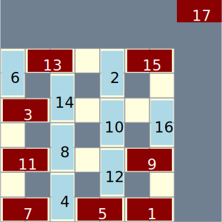

# Assessed assignment 3

## Instructions

* If you have not yet cloned the module Gitlab repository, then do that with:
  ```shell
  git clone https://git.cs.bham.ac.uk/zeilbern/fp-learning-2019-2020.git
  ```
  If you've already cloned the repository, run
  ```shell
  git pull
  ```
  to ensure that you have the most recent version including this assignment.

* Go into the "Assignments/Assessed/Assessed3" directory and *copy* the given `Assessed3Template.hs` to a *new* file `Assessed3.hs`.
  Work on that file to produce your solution and then submit it to Canvas.

  It is important to copy the file as explained, since any future `git pull` may overwrite the template. Hence don't work directly on the template.

* If you work inside another directory besides the git repository, you will also need to copy the file `Types.hs`, which includes type definitions that are imported by the template file.
  Any data or types that you define yourself should be in `Assessed2.hs`, but the ones defined in the assignment are and should stay in `Types.hs`.
  You should **not** modify the `Types.hs` file.

* You will also probably want to copy the file `DomViz.hs`, which contains some visualization procedures based on the [diagrams library](https://archives.haskell.org/projects.haskell.org/diagrams/).
  If you don't already have this library installed on your personal machine, installing it could be as simple as running
  ```
  cabal install diagrams
  ```
  from a terminal.
  On the other hand, if that doesn't work and you have trouble installing the library, your options are to:

  1. try to get help on Slack;
  2. use the lab machines, which already have the diagrams library installed;
  3. comment out the `import DomViz` statement from your solution file.

  Of course, option (3) sadly means that you won't have access to the visualization procedures on your machine.
  They are intended to make the programming task more enjoyable and to help you with debugging, but strictly speaking they are not needed to complete the assignment.

* Because the marking is automatic, we need your submission to be in the correct format, and compile and type check without errors.
  A "presubmit" script will be released, which you need to run before you submit your assignment on Canvas.
  **Submissions that don't pass the presubmit test won't qualify for marks.**

* Be aware that:

  * Your solutions must work with GHC 8.6.5. To use GHC 8.6.5 on a lab machine, see [HardwareAndSoftware.md](../../Resources/HardwareAndSoftware.md).


  * If you wish to import modules, then you may only import libraries from [the standard library](http://hackage.haskell.org/package/base). Additionally, all modules you import must be "Safe" on Hackage.

  * Some of the questions are harder than others, and these are indicated according to the rubric below.
    IT IS OKAY IF YOU DON'T FIND COMPLETE SOLUTIONS TO ALL THE QUESTIONS.

## Background

### The game of Domineering

**Domineering** is a two-player strategy game that can be played over any shape board composed out of some collection of squares.
Players alternate taking turns placing dominoes on the board to cover up a pair of squares, with one player (which we will refer to as "H") always placing them horizontally, and the other player ("V") always placing them vertically.
The first player who cannot make a move loses.

For example, below is the full record of a game played on a 4x4 board, with H playing first in round 1 and winning in round 8, since V has nowhere left to place a domino.


Here is another example of a game on a 5x5 board, where this time H loses in round 13.
(We give only the abbreviated transcript of the game, showing the final position and the labelling of the moves by round.)


A Domineering board does not necessarily have to be square.
For example, here we see the transcript of a game on a board with two columns and nine rows.


Nor does the board have to be contiguous.
Here are some games played on crosshatch-shaped boards of different sizes:


&nbsp;&nbsp;&nbsp;&nbsp;


### Recent developments

This year, one of the most remarkable games in Domineering history was played between Alpha Dom and Lee Sedom, with Alpha Dom claiming victory in round 28.
We show the transcript of the game below, together with another one demonstrating Alpha Dom's mastery over a lower-skilled opponent.

*Alpha Dom vs Lee Sedom* (2019):

 

*Alpha Dom vs Ran Dom* (2019):

 

### Representing the game

In this assignment, you will be tasked with writing various functions related to playing the game of Domineering.
Some of these will be very similar to analogous functions covered in the [Tic Tac Toe](../../../LectureNotes/tictactoe.md) lectures and in Chapter 11 of Hutton, so you may want to review that material as preparation for this assignment.
In a few places we will make slightly different design decisions, which will be signaled.

Let's begin by establishing the basic representation for players, moves, and boards.

```haskell
data Player = H | V
  deriving (Eq, Ord, Show)

type Cell = (Int, Int)

data Board = Board { turn :: Player, free :: [Cell], hist :: [Cell] }
  deriving (Eq, Show)
```

A board is represented by a record containing three fields:
* `turn` specifies the player whose turn it is to play;
* `free` specifies the list of unoccupied squares;
* `hist` specifies the list of previous moves played over the course of the game, *in reverse order.*

We do not make any type distinction between "squares" and "moves": both are represented by values of type `Cell`, this being a synonym for the type `(Int, Int)` of two-dimensional integer coordinates.
However, when we indicate a move by a cell, this is always interpreted as referring to the coordinate of the *lower left corner* of the domino.

For example, consider this board:


```haskell
board4x4_3 = Board { turn = H,
                     free = [(1,1),(1,2),(2,2),(2,3),(2,4),(3,2),(3,3),(3,4),(4,1),(4,2),(4,3),(4,4)],
                     hist = [(1,3),(2,1)] }
```

Here we have assigned coordinates to the cells ranging from (1,1) for the lower left square to (4,4) for the upper right square.
In round 1, H plays a horizontal domino at (2,1), which also occupies the cell (3,1).
In round 2, V plays a vertical domino at (1,3), which also occupies the cell (1,4).
(Note our visualization conventions are the same as we used for the [Game of Life](../../../LectureNotes/Life.md), with the x coordinate increasing as we move rightwards across the board, and with the y coordinate increasing as we move upwards across the board.)

The following utility functions will be useful:
```haskell
-- given a cell c and a player p, compute the adjacent cell c'
-- that is also occupied if p plays a domino at c
adjCell :: Cell -> Player -> Cell
adjCell (x,y) H = (x+1,y)
adjCell (x,y) V = (x,y+1)

-- compute the opponent of a player
opp :: Player -> Player
opp H = V
opp V = H

-- determine whether a move is valid in a given board
valid :: Board -> Cell -> Bool
valid b c = c `elem` free b && adjCell c (turn b) `elem` free b
```

You may also wish to experiment using the following functions that construct boards of different shapes.
```haskell
-- create an empty board from an arbitrary list of cells
empty :: [Cell] -> Board
empty cs = Board { turn = H, free = cs, hist = [] }

-- create a rectangular board of arbitrary dimensions
board :: Int -> Int -> Board
board maxx maxy = empty [(x,y) | x <- [1..maxx], y <- [1..maxy]]

-- create a crosshatch-shaped square board of arbitrary dimension
hatch :: Int -> Board
hatch n = empty [(x,y) | x <- [1..2*n+1], y <- [1..2*n+1], odd y || x == 1 || x == (2*n+1) || odd x]
```

### Representing game trees

We will represent game trees using rose trees just as we did for [Tic Tac Toe](../../../LectureNotes/tictactoe.md), although for convenience we will import the type from `Data.Tree`.
Officially, `Tree a` is defined in `Data.Tree` as a record type in mutual definition with `Forest a`,
```hs
type Forest a = [Tree a]
data Tree a = Node {rootLabel :: a, subForest :: Forest a}
```
but if you prefer you can simply ignore the field labels and the type synonym, treating `Tree` as though it were defined by our usual definition:
```hs
data Tree a = Node a [Tree a]
```

### Visualization

The module [`DomViz`](DomViz.hs) exports a pair of functions
```hs
boardSVG :: Board -> String -> IO ()
gametreeSVG :: Tree Board -> String -> IO ()
```
for visualizing games of Domineering, implemented using the [diagrams library](https://archives.haskell.org/projects.haskell.org/diagrams/).
Given a board `b` and a string `basename`, the command `boardSVG b basename` creates an SVG file named `basename ++ ".svg"` containing a graphical representation of `b`.
For example, visualizations for the two recent victories by Alpha Dom that we mentioned above can be created by running the commands
```hs
> boardSVG alphaDom_vs_LeeSedom "alphadom-vs-leesedom"
> boardSVG alphaDom_vs_RanDom "alphadom-vs-random"
```
after introducing the following definitions:
```haskell
alphaDom_vs_LeeSedom =
  Board { turn = V,
          free = [(-4,1),(-4,3),(-2,0),(-2,4),(2,1),(2,4),(3,-4),(3,4),(4,-2),(4,0)],
          hist = [(0,4),(4,1),(0,-4),(-4,-3),(-1,-2),(2,-1),(-2,-4),(-4,-1),(-1,2),(4,3),(1,2),(-2,2),(-4,-4),(-2,-2),(2,-2),(4,-4),(-3,1),(2,-4),(-4,4),(-1,3),(-4,2),(-3,-2),(3,-1),(1,-3),(-2,-3),(3,1),(1,3)] }

alphaDom_vs_RanDom =
  Board { turn = V,
          free = [(-4,-3),(-4,0),(-2,-4),(-2,-2),(-1,-4),(-1,-2),(-1,2),(-1,4),(0,-4),(0,-2),(0,2),(0,4),(1,-4),(1,-2),(1,2),(1,4),(2,-4),(2,-2),(2,4),(3,-4),(4,0),(4,3)],
          hist = [(-3,4),(2,-1),(-3,2),(4,-2),(-4,-4),(-4,3),(3,4),(2,1),(-3,1),(3,1),(-4,-1),(-2,-1),(-2,3),(-4,1),(1,3),(4,-4),(-4,-2),(4,1),(1,-3),(3,-2),(-2,-3)] }
```

Similarly, given a game tree `t` and a string `basename`, the command `gametreeSVG t basename` creates an SVG file named `basename ++ ".svg"` containing a graphical representation of `t`.
We will give a demonstration of this below.

The `DomViz` module also exports a related pair of functions:
```hs
boardSVG' :: Double -> Board -> String -> IO ()
gametreeSVG' :: Double -> Tree (Board, String) -> String -> IO ()
```
Both take an extra scale factor as first input, in case you want to grow or shrink the SVG graphics, and `gametreeSVG'` takes a game tree where each node has been annotated with a label.
Note that `boardSVG` and `gametreeSVG` are defined by
`boardSVG = boardSVG' 1`
and `gametreeSVG = gametreeSVG' 1 . fmap (\b -> (b,""))`
respectively.

## Questions

This assignment is worth a total of 60 marks.
Harder questions are indicated with extra stars.


1. The first group of questions involves determining what moves are legal, performing legal moves, and "undoing" moves to recover the full record of a game.

   * **[5 marks]**
     Write a function
     ```haskell
     legalMoves :: Player -> Board -> [Cell]
     legalMoves = undefined
     ```
     that returns the list of all legal moves for a player on a given board.  Note that here we mean the legal moves for either player, *regardless* of whether it is that player's turn to play.
     ```hs
     > legalMoves H board4x4_3
     [(1,2),(2,2),(2,3),(2,4),(3,2),(3,3),(3,4)]
     > legalMoves V board4x4_3
     [(1,1),(2,2),(2,3),(3,2),(3,3),(4,1),(4,2),(4,3)]
     ```

   * **[5 marks]**
     Write a function
     ```haskell
     moveLegal :: Board -> Cell -> Board
     moveLegal = undefined
     ```
     that takes a board and a *legal* move for the player whose turn it is to play, and returns the new board resulting from executing that play.
     If the move is actually illegal for the current player, then the behavior of `moveLegal` is unspecified.
     ```hs
     > moveLegal board4x4_3 (2,3)
     Board {turn = V, free = [(1,1),(1,2),(2,2),(2,4),(3,2),(3,4),(4,1),(4,2),(4,3),(4,4)], hist = [(2,3),(1,3),(2,1)]}
     ```
   
   * **[10 marks] (★)**
     Write a function
     ```haskell
     replay :: Board -> [Board]
     replay = undefined
     ```
     that takes a board with some possibly non-empty history of moves, and returns the full record of the game leading up to that position, starting from an initially empty board.
     ```hs
     > replay board4x4_3
     [Board {turn = H, free = [(1,1),(1,2),(2,2),(2,3),(2,4),(3,2),(3,3),(3,4),(4,1),(4,2),(4,3),(4,4),(1,3),(1,4),(2,1),(3,1)], hist = []},Board {turn = V, free = [(1,1),(1,2),(2,2),(2,3),(2,4),(3,2),(3,3),(3,4),(4,1),(4,2),(4,3),(4,4),(1,3),(1,4)], hist = [(2,1)]},Board {turn = H, free = [(1,1),(1,2),(2,2),(2,3),(2,4),(3,2),(3,3),(3,4),(4,1),(4,2),(4,3),(4,4)], hist = [(1,3),(2,1)]}]
     ```
2. The second group of questions are about playing optimally using minimax search on game trees.

   Now that you've implemented `legalMoves` and `moveLegal`, game trees for Domineering can be computed almost exactly as we did for Tic Tac Toe:
   ```haskell
   gametree :: Board -> Tree Board
   gametree b = Node b [gametree (moveLegal b c) | c <- legalMoves (turn b) b]
   ```
   If you like, you can visualize such trees using the `gametreeSVG` function mentioned above.
   For example, the command
   ```hs
   gametreeSVG (gametree (board 3 3)) "board3x3-full"
   ```
   will generate a rendering of the [full game tree](diagrams/board3x3-full.svg) for the 3x3 board with H to start.
   However, you will find that these game trees can grow quite large!
   For example, the full game tree for the 5x5 board has 2103584601 nodes.
   Pruning of game trees can be implemented exactly as before:
   ```haskell
   prune :: Int -> Tree a -> Tree a
   prune 0 (Node x _)  = Node x []
   prune n (Node x ts) = Node x [prune (n-1) t | t <- ts]
   ```
   For example, click here to see the [depth 2 pruned game tree](diagrams/board3x3-depth2.svg) for the 3x3 board.

   Minimax is parameterised by a *scoring function* that assigns values to the leaves of a game tree.
   We will introduce the following type for scores:
   ```haskell
   data Score = Win Player | Heu Int  deriving (Show,Eq)
   ```
   The idea is that either we already know that some player `p` has a winning strategy from a given board, in which case we can assign it the score `Win p`, or else we can assign it some heuristic integer value `Heu x`, with negative values favoring H and positive values favoring V.
   Values of type `Score` are therefore naturally ordered, with
   ```
   Win H <= Heu x <= Win V
   ```
   for all `x`, and
   `Heu x <= Heu y`
   just in case `x <= y`.
   There is a corresponding instance of `Ord Score` provided in `Types.hs`.

   * **[5 marks]**
     Write a scoring function
     ```haskell
     score :: Board -> Score
     score = undefined
     ```
     implementing the following heuristic: if it is `p`'s turn to play, return a win for `p`'s opponent if `p` has no legal moves, and otherwise return a heuristic value based on the formula
     ```
     #(legal moves for V) - #(legal moves for H) - sign(p)
     ```
     where `sign(H) = -1` and `sign(V) = 1`.
     
     Example:
     ```hs
     > score board4x4_3
     Heu 2
     ```

   * **[5 marks]**
     Write a function
     ```haskell
     minimax :: (Board -> Score) -> Tree Board -> Tree (Board, Score)
     minimax = undefined
     ```
     that annotates every node of a game tree with a minimax score, computed relative to an arbitrary scoring function for the leaves (first argument).
     Your implementation will probably be very similar to the implementation of `minimax` we wrote for [Tic Tac Toe](../../../LectureNotes/tictactoe.md), except that it takes the extra scoring function as a parameter.
     It should leave the tree untouched other than annotating each node with a score (in other words, it should satisfy `fmap fst (minimax sfn t) = t`).

     Click here to see the [minimax scoring of the depth 2 pruned game tree](diagrams/board3x3-depth2-minimax.svg) for the 3x3 board, using the scoring function `score` from above.
     This diagram was generated with the following command:
     ```hs
     gametreeSVG' 1 (fmap (\(b,v) -> (b,show v)) $ minimax score $ prune 2 $ gametree (board 3 3)) "board3x3-depth2-minimax"
     ```

   * **[10 marks]**
     Write a function
     ```haskell
     bestmoves :: Int -> (Board -> Score) -> Board -> [Cell]
     bestmoves = undefined
     ```
     which takes a depth `d` and a scoring function `scorefn` as parameters, and defines a function from boards to lists of *optimal* moves.
     Each move returned should be optimal in the sense that it has the best minimax score for the current player, relative to the scoring function `scorefn` applied to the game tree pruned to depth `d`.
     Moreover, the list returned should be the *complete* list of optimal moves, although they can be returned in any order.

     Take notice that an optimal move is not necessarily a *winning* move, in the case where the player has no better options.
     Your implementation will probably be very similar to the function `bestmove` we wrote using `minimax` for Tic Tac Toe, except that we are asking you to return the list of *all* optimal moves.
     
     Examples:
     ```hs
     > bestmoves 4 score (board 3 3)
     [(1,2),(2,2)]
     > bestmoves 4 score (moveLegal (board 3 3) (1,2))
     [(3,1),(3,2)]
     ```
     
3. Now that you've implemented `bestmoves`, we can combine it with an operation `chooseSafe` implemented using our old friend the `PickingMonad` to get a player who selects optimal moves at random, and compare it against a player who selects legal moves at random.
   ```haskell
   chooseSafe :: PickingMonad m => [a] -> m (Maybe a)
   chooseSafe [] = return Nothing
   chooseSafe xs = do
     i <- pick 0 (length xs - 1)
     return (Just (xs !! i))
   
   randomBestPlay :: PickingMonad m => Int -> (Board -> Score) -> Board -> m (Maybe Cell)
   randomBestPlay d sfn = chooseSafe . bestmoves d sfn
   randomPlay :: PickingMonad m => Board -> m (Maybe Cell)
   randomPlay b = chooseSafe (legalMoves (turn b) b)
   ```
   Note we have to use `chooseSafe` here, which returns a `Maybe` type, since it is possible that the list of optimal/legal moves is empty.

   * **[10 marks]**
     Write a function
     ```haskell
     runGame :: PickingMonad m => (Board -> m (Maybe Cell)) -> (Board -> m (Maybe Cell)) -> Board -> m Board
     runGame = undefined
     ```
     that takes two players `playH` and `playV` of type `Board -> m (Maybe Cell)`, and plays them off against each other starting from some initial board to produce a final board.
     It should run in any `PickingMonad`, and it should stop and return the current board as soon as either player gives up (i.e., returns `Nothing`) or makes an illegal move.

     For example, here are three games on a 4x4 board produced by setting `randomBestPlay 8 score` vs `randomBestPlay 8 score`, `randomPlay` vs `randomBestPlay 8 score`, and `randomPlay` vs `randomPlay`, respectively.
     
     
     &nbsp;&nbsp;&nbsp;&nbsp;
     
     &nbsp;&nbsp;&nbsp;&nbsp;
     

4. Now that you have a good supply of Domineering players, you'd like some more interesting boards!
   * **[10 marks] (★)**
     Write a function
     ```haskell
     carpets :: [Board]
     carpets = undefined
     ```
     that generates an infinite sequence of empty boards, corresponding to the successive iterations of the [Sierpinski carpet](https://en.wikipedia.org/wiki/Sierpinski_carpet), where player H starts on even-numbered carpets and V starts on odd-numbered carpets.
     Here's what the first few look like (we omit `carpets !! 0`, which is a pretty boring board):

     **`carpets !! 1`** = 

     **`carpets !! 2`** = 

     **`carpets !! 3`** = 


## A challenge problem, and the official AFP Domineering Challenge

If you've already finished the assignment and want to try a harder problem, you can think about how to improve your minimax-based player by implementing [alpha-beta pruning](https://en.wikipedia.org/wiki/Alpha%E2%80%93beta_pruning).

Later, as we did with the "wordrects challenge", we will run a mini-competition to find the most effective Domineering-playing programs.
Precise rules are to be announced, but will involve implementing a *strategy function*

```hs
strategy :: PickingMonad m => Board -> m (Maybe Cell)
```

that takes a board and returns a move, potentially using randomness.
